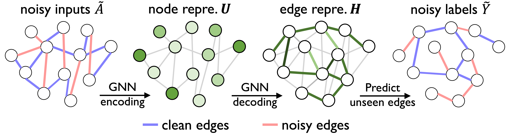
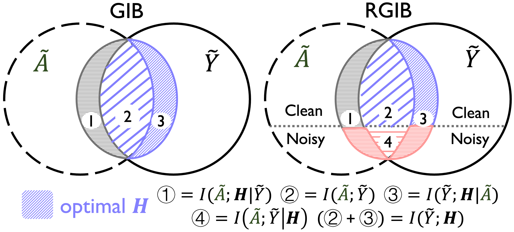
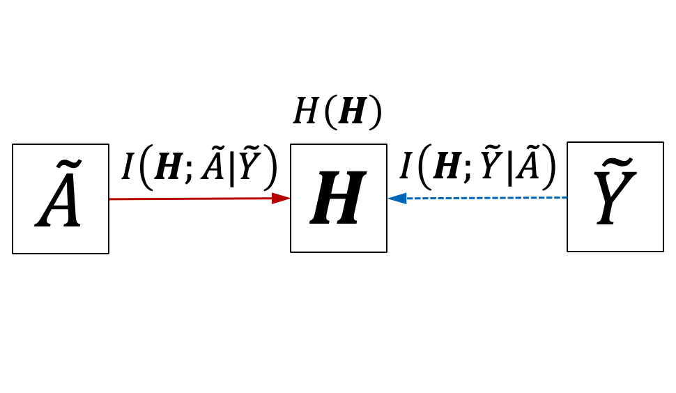
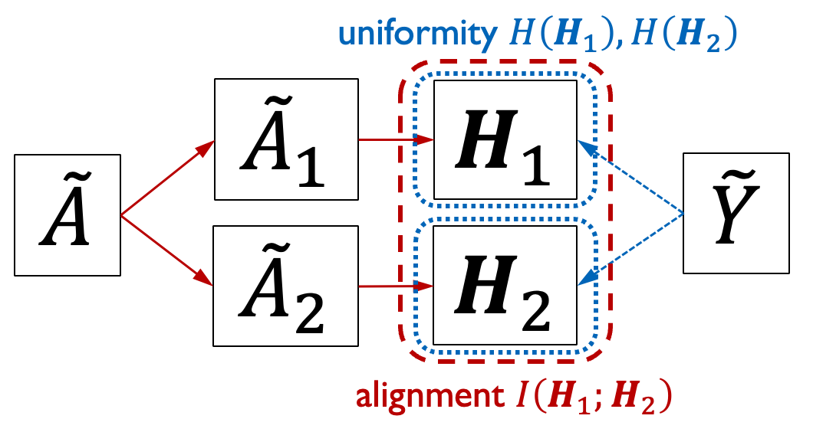
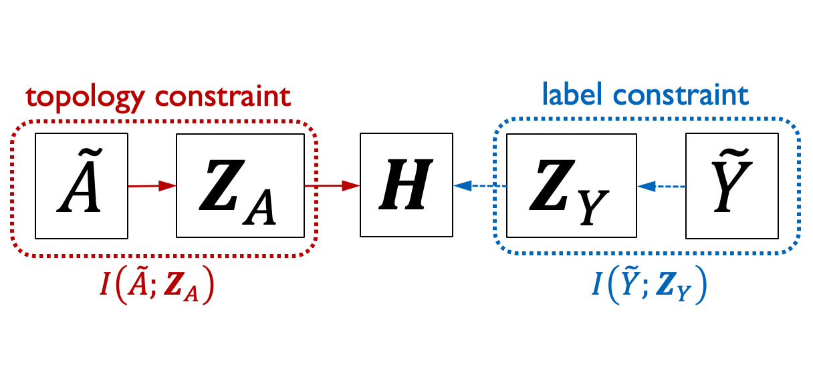

Official code for the paper "Combating Bilateral Edge Noise for Robust Link Prediction" (NeurIPS 2023).


## Introduction

Although link prediction on graphs has achieved great success with the development of graph neural networks (GNNs), the potential robustness under the edge noise is still less investigated. To close this gap, we first conduct an empirical study to disclose that the edge noise bilaterally perturbs both input topology and target label, yielding severe performance degradation and representation collapse. 



<p align="center"><em>Figure 1.</em> Link prediction with bilateral edge noise. The GNN takes the graph as inputs, generates the edge representation, and then predicts the existence of unseen edges with labels.</p>

To address this dilemma, we propose an information-theory-guided principle, Robust Graph Information Bottleneck (RGIB), to extract reliable supervision signals and avoid representation collapse. Different from the basic information bottleneck, RGIB further decouples and balances the mutual dependence among graph topology ($\tilde{A}$), target labels ($\tilde{Y}$), and representation ($\bf{H}$), building new learning objectives for robust representation against the bilateral noise. 

<p align="center"></p>

<p align="center"><em>Figure 2.</em> The principles of basic GIB and the proposed RGIB.</p>

Two instantiations, RGIB-SSL and RGIB-REP, are explored to leverage the merits of different methodologies, i.e., self-supervised learning and data reparameterization, for implicit and explicit data denoising, respectively. 

<table><tr>
<td></td>
<td></td>
<td></td>
</tr></table>

<p align="center"><em>Figure 3.</em> Digrams of RGIB (left) and its two instantiations RGIB-SSL (middle) and RGIB-REP (right).</p>


## Usage

### Step1. Installation (with pip)

Create a new virtual environment.
```
python -m venv ~/RGIB
source ~/RGIB/bin/activate 
```

Install the essential dependencies.
```
pip install torch==1.12.1+cu113 --extra-index-url https://download.pytorch.org/whl/cu113

pip install torch-scatter==2.0.9 torch-sparse==0.6.15 torch-cluster==1.6.0 torch-geometric==2.1.0 -f https://data.pyg.org/whl/torch-1.12.1+cu113.html

pip install networkx pygcl dgl packaging pandas hyperopt
```

### Step2. Generate noisy data (in `code/`)

Template:
```
python3 mixed-noise-generation.py --dataset "dataset name" --noise_ratio "a float"
```
Note that 
- `dataset` is in range of `[Cora, Citeseer, Pubmed, chameleon, squirrel, facebook]`.
- `noise_ratio` is in range of `[0,1]`.

Examples:
```
python3 mixed-noise-generation.py --dataset Cora --noise_ratio 0.2

python3 mixed-noise-generation.py --dataset Citeseer --noise_ratio 0.2
```

### Step3. Training with noisy data (in `code/`)

#### Standard training with cross-entropy loss.
Template:
```
python3 standard-training.py --gnn_model "GNN name"  --num_gnn_layers "an integer" --dataset "dataset name" --noise_ratio "a float" 
```

Examples:
```
python3 standard-training.py --gnn_model GCN  --num_gnn_layers 4 --dataset Cora --noise_ratio 0.2

python3 standard-training.py --gnn_model GAT  --num_gnn_layers 4 --dataset Citeseer --noise_ratio 0.2
```

Note that
- `gnn_model` can be `GCN, GAT`, or `SAGE`.
- make sure the `dataset` with a certain `noise_ratio` has been generated in Step2.

#### Training with RGIB-SSL / RGIB-REP.

Template:
```
python3 RGIB-ssl-training.py --gnn_model "GNN name"  --num_gnn_layers "an integer" --dataset "dataset name" --noise_ratio "a float" --scheduler "scheduler_name" --scheduler_param "a float"

python3 RGIB-rep-training.py --gnn_model "GNN name"  --num_gnn_layers "an integer" --dataset "dataset name" --noise_ratio "a float" --scheduler "scheduler_name" --scheduler_param "a float"
```

Examples:
```
python3 RGIB-ssl-training.py --gnn_model GCN --dataset Cora --noise_ratio 0.2 --scheduler linear --scheduler_param 1.0

python3 RGIB-rep-training.py --gnn_model GCN --dataset Cora --noise_ratio 0.2 --scheduler constant --scheduler_param 1.0
```

Note that
- `scheduler` can be `linear`, `exp`, `sin`, `cos`, or `constant`.
- `scheduler_param` is used to set the certain `scheduler`.

In addition, we implement the automated searching of `scheduler` and `scheduler_param`, e.g., searching for 50 trials as follows.
```
python3 RGIB-ssl-training.py --gnn_model GCN --dataset Cora --noise_ratio 0.2 --search_scheduler --search_iteration 50

python3 RGIB-rep-training.py --gnn_model GCN --dataset Cora --noise_ratio 0.2 --search_scheduler --search_iteration 50
```


### Citation

If you find our work useful, please kindly cite our paper.
```bibtex
@inproceedings{zhou2023combating,
title={Combating Bilateral Edge Noise for Robust Link Prediction},
author={Zhanke Zhou and Jiangchao Yao and Jiaxu Liu and Xiawei Guo and Quanming Yao and Li He and Liang Wang and Bo Zheng and Bo Han},
booktitle={Advances in Neural Information Processing Systems},
year={2023},
}
```
